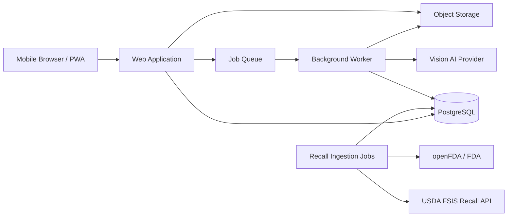
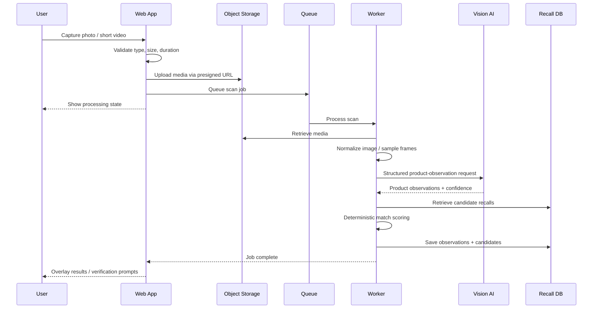

# V1 Technical Architecture

## 1. Objective

Build a mobile-first browser service that lets a user photograph or record a short video of packaged foods and beverages, identifies visible product candidates, compares those candidates against authoritative U.S. recall data, and directs the user to verify only the small subset of products that may match a recall.

The architecture must preserve a hard boundary between:

- **visual identification / triage**, which may be probabilistic; and
- **recall verification**, which must be grounded in authoritative recall records and package-specific evidence where required.

V1 is not intended to prove that every product in a scene is safe. It is intended to reduce unnecessary manual barcode scanning while finding plausible recall candidates with high recall sensitivity.

---

## 2. V1 System Context



### Architectural principle

V1 should be a **modular monolith plus worker**, not a set of independently deployed microservices.

This provides clear boundaries for later scaling without creating operational complexity before product-market fit.

---

## 3. Recommended Technology Stack

Versions should be pinned to current stable releases when implementation begins and committed through the lockfile.

### Web application

- **Next.js App Router**
- **React + TypeScript**
- Mobile-first responsive UI
- Progressive Web App manifest and installability
- Browser camera/file capture using standard web APIs
- Server-side API endpoints for authenticated application operations

### Background processing

- **Node.js + TypeScript worker**
- **BullMQ** job processing
- **Redis** queue / transient job coordination
- **FFmpeg** for server-side video frame sampling where needed

Keeping both the web app and worker in TypeScript minimizes context switching and makes Codex-driven incremental development easier.

### Data

- **PostgreSQL** as the system of record
- **Prisma** for typed schema, migrations, and database access
- PostgreSQL full-text/trigram search initially for recall candidate retrieval
- Vector search is explicitly deferred unless evaluation proves it is necessary

### Media storage

- S3-compatible private object storage
- Presigned upload/download URLs
- Short retention period for submitted media
- MinIO can be used for local development

### AI

Use the **OpenAI Responses API with image inputs** behind a provider interface. The application should request structured JSON output matching a strict application schema rather than free-form prose.

The AI model is used to observe products and visible package attributes. It does **not** receive authority to determine whether a recall is valid or active.

### Recall sources

V1 authoritative source adapters:

1. FDA/openFDA Food Enforcement data
2. FDA recall-page data where needed to enrich current consumer-facing recall state
3. USDA FSIS Recall API

All source records are normalized into the application's own recall schema while retaining source provenance.

---

## 4. Monorepo Layout

```text
Food-Recall-Scanner/
├── apps/
│   ├── web/                   # Next.js PWA
│   └── worker/                # async media, AI, recall ingestion jobs
├── packages/
│   ├── db/                    # Prisma schema/client/migrations
│   ├── domain/                # shared types + domain rules
│   ├── recall/                # source adapters + normalization + matching
│   ├── vision/                # AI provider interface + schemas
│   ├── config/                # environment validation/shared config
│   └── testing/               # fixtures/test helpers
├── docs/
├── fixtures/
│   ├── recalls/               # sanitized source fixtures
│   └── scans/                 # test metadata; no private user media
├── .github/
│   └── workflows/
├── package.json
├── pnpm-workspace.yaml
└── README.md
```

A workspace package manager such as **pnpm** is recommended.

---

## 5. End-to-End Scan Workflow



### Photo path

1. Browser captures or selects image.
2. Client performs basic validation and optional downscale for upload efficiency.
3. Original/normalized image is stored privately.
4. Worker sends a suitable image representation to the vision provider.
5. AI returns structured detected-product observations, including approximate bounding boxes.
6. Recall engine retrieves plausible recall records.
7. Deterministic scoring assigns candidate-match strength.
8. UI overlays results on the image.

### Video path

V1 does not require model-native video understanding.

1. User records a short video with a strict duration/size limit.
2. Worker samples frames at a controlled interval and rejects unusably blurry frames.
3. Per-frame product observations are merged using approximate spatial/product identity.
4. Duplicate detections are collapsed into one observed item while combining evidence from multiple frames.
5. Matching proceeds exactly as with a photo.

This lets video improve coverage without making the core product dependent on a specialized video model.

---

## 6. Vision Output Contract

The AI layer must return structured observations only.

Representative domain shape:

```ts
interface ProductObservation {
  id: string;
  frameId?: string;
  boundingBox: {
    x: number;
    y: number;
    width: number;
    height: number;
  };
  category?: string;
  brand?: ObservedField;
  productName?: ObservedField;
  variant?: ObservedField;
  packageSize?: ObservedField;
  upc?: ObservedField;
  lotCode?: ObservedField;
  bestBy?: ObservedField;
  rawVisibleText: string[];
  observationConfidence: number;
}

interface ObservedField {
  value: string;
  confidence: number;
}
```

Bounding boxes should use normalized coordinates so the UI can scale overlays to any display size.

### Non-negotiable rules

- No recall status comes from the vision model.
- No source URL comes from model memory.
- Missing fields remain missing; the model must not infer a UPC, lot number, or expiration date.
- Raw observed text should be retained separately from normalized values for debugging and evaluation.

---

## 7. Recall Data Model

Core entities:

```text
RecallEvent
├── id
├── agency                FDA | USDA_FSIS
├── sourceEventId
├── sourceUrl
├── sourceStatus
├── classification
├── recallingFirm
├── recallReason
├── initiationDate
├── reportDate
├── terminationDate?
├── distributionText?
├── rawSourceHash
├── sourceLastSeenAt
└── normalizedAt

RecallProduct
├── id
├── recallEventId
├── brandNames[]
├── productNames[]
├── productDescription
├── packageSizes[]
├── upcs[]
├── lotCodes[]
├── dateCodeText[]
├── establishmentNumbers[]
└── normalizedSearchText

Scan
├── id
├── mediaType
├── status
├── storageKey
├── createdAt
├── expiresAt
└── errorCode?

ProductObservation
├── id
├── scanId
├── boundingBox
├── observed fields
├── rawVisibleText
└── model metadata

RecallCandidate
├── id
├── observationId
├── recallProductId
├── candidateScore
├── evidence JSON
├── disposition
└── createdAt

Verification
├── id
├── candidateId
├── upc?
├── lotCode?
├── bestBy?
├── establishmentNumber?
├── verificationResult
└── evidence JSON
```

Every normalized recall must retain enough provenance to trace a displayed result back to the authoritative government record.

---

## 8. Recall Matching Engine

The recall matching engine is application code, not an LLM prompt.

### Candidate retrieval

Use broad/high-recall retrieval over fields such as:

- normalized brand
- product name tokens
- product category
- recalling firm
- package size
- visible UPC
- recall product description

### Deterministic evidence score

Initial scoring should be configurable rather than hard-coded throughout the application.

Example evidence strengths:

| Evidence | Relative strength |
|---|---|
| Exact UPC included in recall | Very high |
| Lot/date code included in recall | Very high |
| USDA establishment number match | Very high |
| Exact brand + product + size | High |
| Brand + close product-name match | Medium-high |
| Brand only | Low |
| Broad product category only | Very low |

Do not treat the score as a probability that the physical package is recalled. It is a ranking/confidence measure for how strongly an observation resembles the product description in an authoritative recall.

### Candidate states

- `NO_PLAUSIBLE_MATCH`
- `REVIEW_RECOMMENDED`
- `STRONG_PRODUCT_MATCH_NEEDS_PACKAGE_VERIFICATION`
- `VERIFIED_MATCH`
- `VERIFIED_NOT_MATCH`
- `INSUFFICIENT_EVIDENCE`

---

## 9. User-Facing Confidence Model

Never display a single combined percentage labeled as "chance this product is recalled."

Expose three concepts independently:

1. **Identification confidence** — how confident the system is about what product it sees.
2. **Recall match strength** — how strongly that identified product overlaps a government recall description.
3. **Verification state** — whether package-specific evidence establishes inclusion/exclusion.

The user should see language such as:

- "Possible recall match — verify this package"
- "Strong product match; lot/date not visible"
- "Verified UPC does not match the affected product"
- "Verified package identifiers match the recall record"

---

## 10. Verification Flow

When a candidate requires verification, the app opens an item-specific verification workflow.

V1 verification inputs:

1. Barcode scan using browser camera where supported
2. Manual barcode entry fallback
3. Guided close-up photo for lot / best-by text
4. Manual correction when OCR/vision is uncertain
5. USDA establishment number capture where relevant

The verifier compares captured evidence only against the selected authoritative recall product record(s).

---

## 11. API Surface

Initial internal API endpoints:

```text
POST   /api/scans
POST   /api/scans/:id/upload-complete
GET    /api/scans/:id
GET    /api/scans/:id/results
POST   /api/candidates/:id/verify
GET    /api/recalls/:id
GET    /api/health
```

Worker job types:

```text
scan.process-photo
scan.process-video
scan.expire-media
recall.ingest-fda
recall.ingest-fsis
recall.normalize
recall.reindex
```

Administrative/diagnostic endpoints should not be publicly exposed without authentication.

---

## 12. Privacy and Security

A pantry scan can inadvertently contain family photos, addresses, prescription labels, faces, or other private information. Media therefore receives stronger handling than ordinary analytics data.

### V1 controls

- HTTPS only outside local development
- private object storage; no public buckets
- presigned URLs with short expirations
- strict MIME, file-size, pixel/duration validation
- server-generated object keys
- no user-supplied storage paths
- automated media deletion after a short configurable retention period
- do not train any application-specific model from user media without explicit future consent design
- secrets only in environment/secret manager
- rate limiting on scan creation and verification endpoints
- structured audit events for recall-data ingestion and result generation
- dependency and secret scanning in CI
- no recall assertion generated solely from AI prose

### Authentication

Guest scanning is desirable for low friction. V1 architecture should therefore support an anonymous scan session backed by a signed, high-entropy browser token.

Account creation can be deferred until saved pantry / notifications are introduced.

---

## 13. Observability

Capture metrics from the beginning:

### Product quality

- number of products manually visible in evaluation image
- products detected
- correct brand identifications
- correct exact product identifications
- false product detections
- recall candidate recall/precision
- verification completion rate

### Operations

- scan job latency
- AI request latency / failures
- AI cost per scan
- video processing time
- ingestion freshness
- source adapter failures
- queue depth
- media deletion failures

Do not log raw user images or sensitive extracted text into general application logs.

---

## 14. Testing Strategy

### Unit tests

- recall normalization
- text normalization
- candidate scoring
- verification logic
- source parsing
- security validation

### Contract tests

- AI structured-output schema
- FDA source adapters
- USDA FSIS source adapter

### Integration tests

- upload -> job -> observation -> candidate result
- recall ingestion idempotency
- candidate verification
- media-expiration workflow

### Golden evaluation set

Maintain a controlled set of pantry/product images with manually labeled:

- product boxes
- brand
- product name
- visible identifiers
- expected recall candidates

This evaluation set is essential. "Looks good" manual testing is not sufficient for a safety-related triage product.

---

## 15. Deployment Model

Recommended early deployment separation:

```text
Web / API      -> managed Next.js-capable hosting
Worker         -> container-capable managed compute
PostgreSQL     -> managed PostgreSQL
Redis          -> managed Redis
Object storage -> S3-compatible managed storage
```

The worker must be able to execute FFmpeg and process jobs independently of request/response limits in the web hosting environment.

Local development should be reproducible through Docker Compose for PostgreSQL, Redis, and MinIO while the web and worker processes can run directly from the workspace.

---

## 16. Explicit V1 Non-Goals

Do not allow these to expand the initial build:

- native iOS / Android apps
- household-product / CPSC recalls
- prescription-drug recall scanning
- persistent AI-generated pantry inventory
- family sharing
- push notifications
- retailer purchase-history integrations
- custom-trained computer-vision model
- continuous live-camera inference
- full offline operation
- a public recall-search portal competing with FDA search

The architecture leaves room for these capabilities without requiring them for the first useful product.
